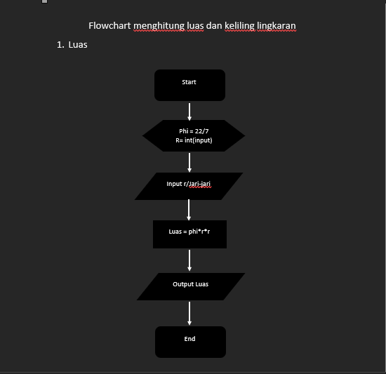
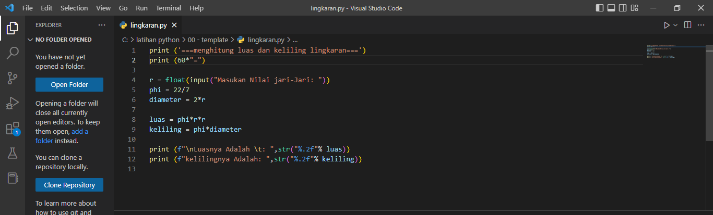
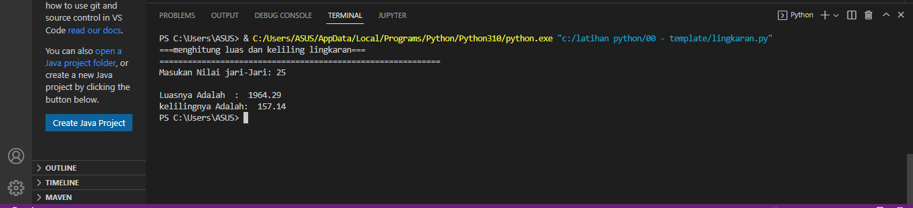

# Menghitung Luas dan Keliling Lingkaran

1. Kita buat flowchat nya terlebih dahulu, bisa di lihat gambar berikut
- Luas

- Keliling


2. Masuk ke program
   
- setelah membuat flowchart kita masuk ke visual studio code untuk membuat program menghitung luas dan keliling lingkran di python
  
* buat file terlebih dahulu ` Lingkaran.py `
  kita  masukan sintaks atau codenya berikut

  ``` 
  print ("menghitung luas dan kelilig lingkaran")
  print (60*=) 

  r = float(input("Masukan Nilai Jari-jari: "))
  phi = 22/7
  diameter = 2*r
  
  luas = phi*r*r
  keliling = phi * diameter

  print (f"\nluasnya adalah: ",str("%.2f"%luas))
  print (f"kelilingnya adalah: ",str("%.2f"%keliling))
  ```
  berikut sintaks code di python
  

  Dan ini lah hasil outputnya
  

  Seperti itulah cara menghitung luas dan keliling lingkaran. Terima kasih.